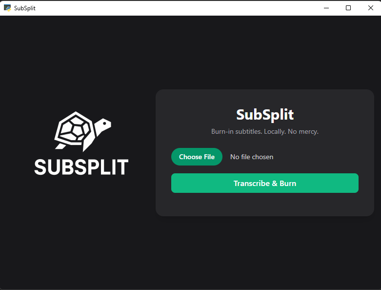

# 🟪 SubSplit

### **"Because your clips deserve more than subtitles thrown on with a prayer."**

**SubSplit** is a local-first, GPU-aware subtitle tool made for streamers, YouTubers, and overengineers who'd rather automate their captions than ever open Premiere Pro again.

Powered by [OpenAI's Whisper](https://github.com/openai/whisper) and [PyAnnote](https://github.com/pyannote/pyannote-audio), SubSplit doesn't just slap text on screen:

- 🧠 **Diarizes** who's talking—even in chaotic Discord calls.
- 🎨 **Color-codes** speakers for clarity (WIP).
- 🖋️ **Burns clean .ass subtitles** into your video with FFmpeg.
- 🔄 **Processes multiple files** in batches.
- 🖱️ **Drag-and-drop UI** with ETA and job feedback.

---

## ⚙️ Features (Working)

- 🎤 **Speaker Diarization** — Detect and separate speakers.
- 🧠 **Whisper Transcription** — Uses large model locally via GPU.
- 🔥 **Replay-buffer‑friendly Design** — Fast processing, no cloud calls.
- 💾 **Embedded Subtitle Export** — .ass subtitles burned directly into MP4.
- ⚫ **Dark Mode UI** — Built-in and non-negotiable.
- 🧠 **Local Database** — Keeps track of processed videos.

---

## 🚧 Work In Progress

- 🎨 Per-speaker subtitle color styling
- 🧪 Funny moment detection / smart highlight tagging
- 🪄 OBS Replay Buffer Marker integration
- 🖼️ UI polish: logo display, progress bar improvements
- 🗂️ Folder watcher + auto-process queue
- 🧠 WebSocket-powered Web UI (React/Tailwind rewrite plan)

---

## 🖥️ Showcase (WIP UI)



UI built with plain HTML + TailwindCSS for now. No build step, just vibes.

---

## 🚀 Getting Started

```bash
git clone https://github.com/Dyhrr/SubSplit
cd SubSplit
pip install -r requirements.txt
python run.py  # or cli.py if you're hardcore
```

❗ Make sure you have:
- [FFmpeg](https://ffmpeg.org/download.html) in PATH
- HuggingFace token for diarization model
- Whisper + Torch installed

---

## 🧠 Tech Stack

- 🐍 **Python 3.11**
- 🔊 **Whisper (large)** — Transcription
- 🧍 **PyAnnote** — Diarization
- 🎨 **ASS subtitles** — Color-ready format
- 🎥 **FFmpeg** — Video burn-in
- 🖥️ **Tailwind UI** — Basic dark-mode frontend
- ⚙️ **FastAPI + Uvicorn** — Local API layer

---

## 📦 Roadmap

- [ ] OBS Replay Buffer marker extraction
- [ ] Color-coded speaker styles in subtitles
- [ ] Highlight tagging & smart funny-moment clustering
- [ ] Web interface using React + shadcn/ui
- [ ] Auto-installer + packaging with PyInstaller
- [ ] Voice separation pre-processing (experimental)

---

## 🐞 Known Issues

- 🧠 PyAnnote model is from 0.x — expect logs to whine about version mismatch.
- 🖼️ Some .svg logos render oddly in-app, may fallback to .png.
- 💥 Using large Whisper model without GPU will destroy your will to live.

---

## 🧙 Author

### Nick / Dyhrrr

Builder. Breaker. Tweaker. Danish. Not a UX designer.

📬 Want to flame, help, or say hi? [Open an issue](https://github.com/Dyhrr/SubSplit/issues)

---

## 🛡 License

MIT License. No bullshit. Attribution appreciated.

Use it, improve it, ship it. Just don’t resell it as a SaaS and pretend you built it alone.
